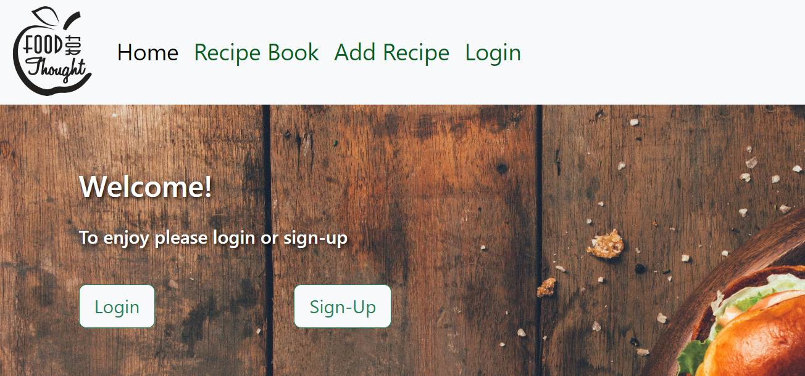
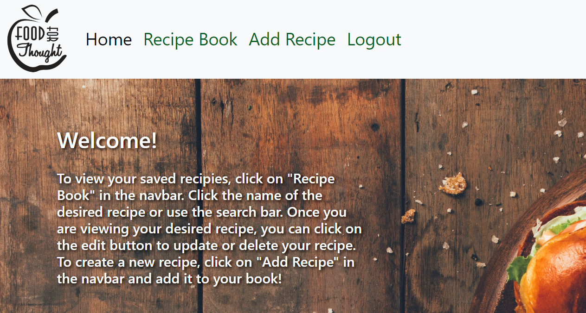
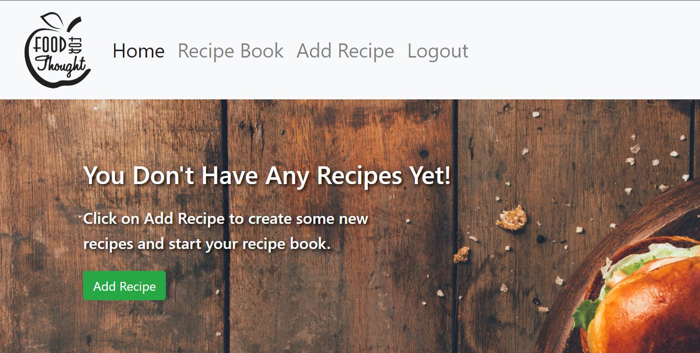
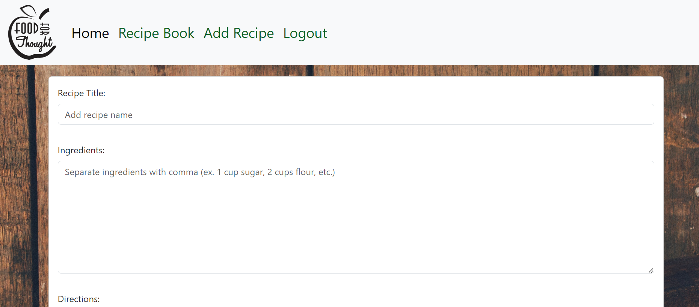
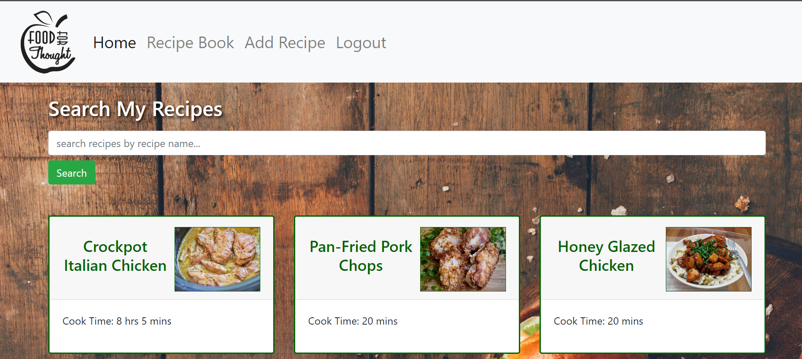
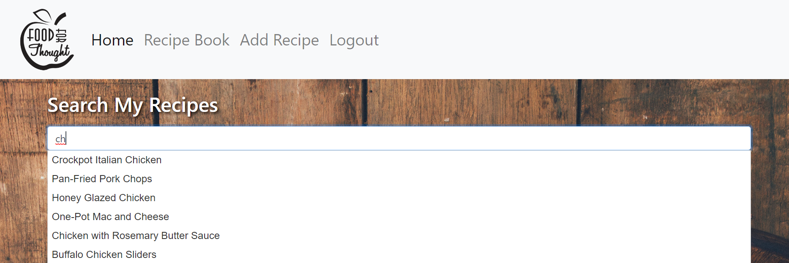
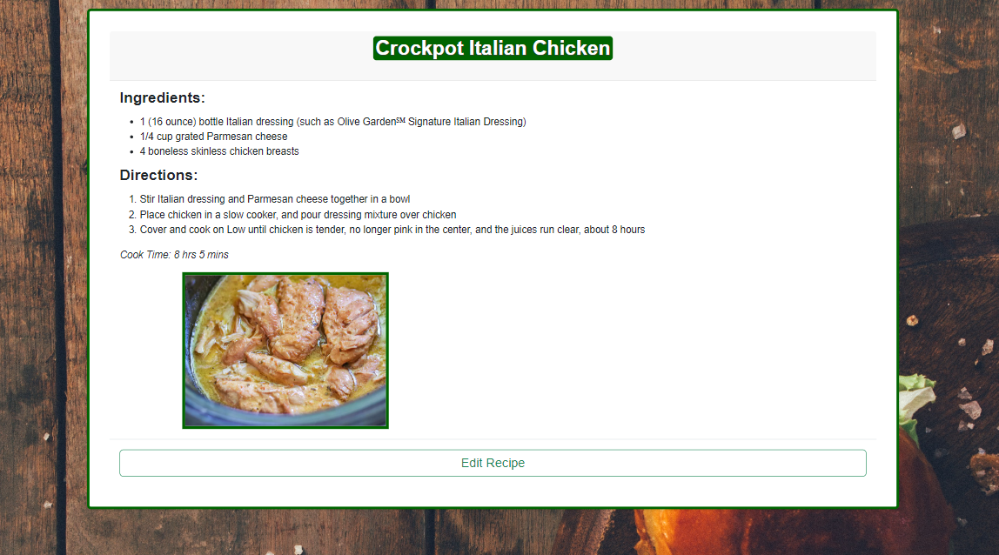
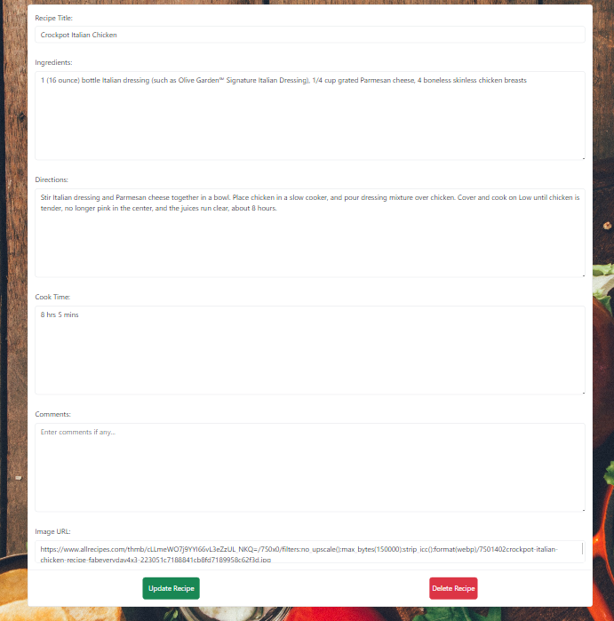

# Food 4 Thought

## Table of Contents

- [Project Description](#description)
- [Usage](#usage)
- [Installation](#installation)
- [Contribution](#contribution)
- [Credits](#credits)
- [Questions](#questions)
- [Test](#test)

## Description

This application allows users to create, store, and update their very favorite recipes. It was created to be a virtual cookbook to keep all recipes in one place so the user never loses a go to recipe again.

## Usage

To open the deployed application in your browser, click [here](#). You will be directed to the homepage which prompts you to sign up or login.          After logging in, the user will see a welcome page with instructions on how to use the app:          Initally, your recipe book will be empty but you can add recipes by clicking on the "Add Recipe" button in on the page or by clicking the link in the navbar.                   After you've added some recipes, you'll see recipe cards in your recipe book.          You can click on the recipe name or you can use the search bar to search by recipe name using the autocomplete feature to select your desired recipe.                   Once viewing the full recipe card, you can click on edit to update or delete your recipe.         

## Installation

N/A

## Contribution

Megan Vincent  
Shannon Price  
Alphonse Johnson  

## Credits

Tutorials Followed: 
[Node.js Autocomplete Search From MySQL Database](https://www.tutsmake.com/node-js-mysql-autocomplete-search-example/)

## Questions

The github repo can be found [here](https://github.com/MVincent15/Food4Thought).
The deployed application can be found [here](#).

For additional questions, please contact:

- vincent.megan23@gmail.com
- shannonkprice00@gmail.com
- a.joh26@gmail.com

## Test

N/A
